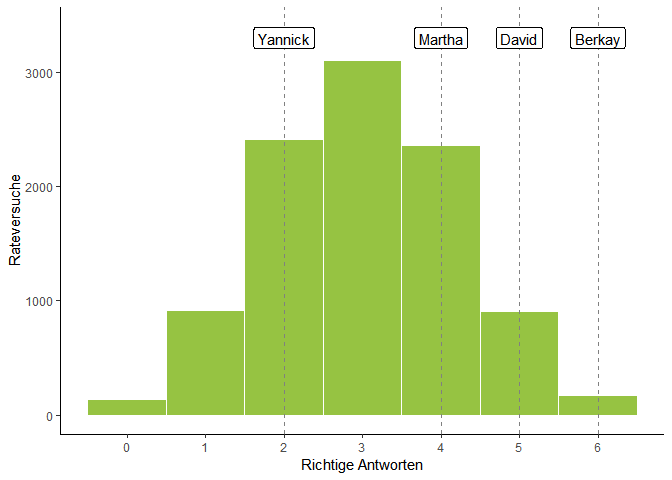
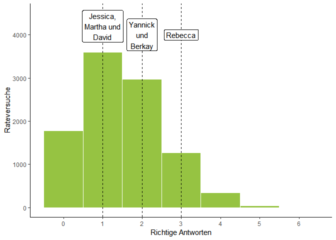

Pepsi, Coca Cola und die Geschichte der Nullhypothese
================
Manuel Neumann
17.06.2019

# “Pepsi schmeckt gaaaanz anders\!”

Wie viele gute Geschichten beginnt auch diese hier in einer Bar.
Genauers gesagt in einem Irish Pub. Hier saß ich eines Abends mit
Freunden zusammen, als die Kellnerin kam und unsere Bestellung aufnahm.
Schnell war diese aufgegeben, aber Yannik behielt die Getränkekarte noch
einen Moment in der Hand. “Mh. Die haben hier nur Pepsi.”, so sein
ersteinmal recht unscheinbare Kommentar. Doch schnell entstand eine
kleine Diskussion am Tisch. Schmeckt Pepsi besser oder schlechter als
Coca Cola? Gab es überhaupt einen Unterschied? Kann man diesen denn so
eindeutig feststellen? Schnell war klar, dass sich diese Fragen hier im
Pub wohl nicht so schnell lösen ließen und so einigten wir uns darauf
der Sache mit einer Verkostung der beiden Marken bei der nächsten
WG-Party auf den Grund zu gehen.

Natürlich hätte man die Sache dabei belassen können, bei der nächsten
Party eine Flasche Pepsi und eine Flasche Coca Cola mitzubringen und
dann mit dem Gesichtsausdruck eines Someliers bei der Weinprobe über die
Unterschiede der zwei Koffeingetränke zu diskutieren. Doch so einfach
ließ mich die Sache nicht los. Vor allem erinnerte mich die Frage an
eine meiner Seminare über Experimente, Wahrscheinlichkeit und
statistische Methoden. Ja, eine ähnliche Frage führte tatsächlich zu
einer der größten Weichenstellungen der statistischen Datenanalysen.

# Wie unterscheidet man zwischen einer Expertin und einer Lügnerin?

Die Frage ist nämlich die folgende: Kann ich (m)einem Urteil wirklich
trauen? Sagen wir einmal, mir stellt jemand ein Glas mit einem schwarzen
Erfrischungsgetränk hin, dass entweder aus einer Pepsi- oder Coca
Cola-Flasche stammt, und stellt mich vor die Aufgabe, eine Aussage
darüber zu treffen, um welches Getränk es sich wohl handelt. Nun kann
es zwei Szenarien geben: Entweder ich bin mir nach einer Geschmacksprobe
sicher, um was es sich handelt, oder ich bin es mir nicht und rate. Im
ersten Fall gebe ich also meine Meinung kund, im zweiten sage ich
zufällig Pepsi oder Coca Cola. Da ich mich aber nur einmal zwischen den
beiden Marken entscheiden muss, ist die Chance, dass ich mit meiner
geratenen Angabe richtig liege genau einhalb oder 50%. Es ist, als würde
ich einmal eine perfekte Münze werfen und danach mein Urteil fälle. Die
Chance, dass ich also als völlig Ahnungsloser Limo-Verkoster als
Pepsi-Coca-Cola-Spezialist gelte ist relativ groß. Oder anders
ausgedrückt: Die Person die mich testet, kann sich nicht sicher sein,
ob es einen Unterschied zwischen den Marken gibt und ich den Unterschied
schmecken kann, im Falle, dass ich ihr die richtige Antwort gebe.

Es braucht also mehr um wirklich feststellen zu können, ob Pepsi und
Coca Cola verschieden schmecken und ob jemand die beiden
auseinanderhalten kann oder nur wild ins Blaue hinein rät. Die wohl
naheliegendste Lösung ist wohl auch die einfachste: statt nur ein Glas
bestimmen zu müssen, muss die Testperson die Flüssigkeit in zwei Gläsern
bestimmen. Schon ganz intuitiv ist klar, dass es schwerer ist zwei Mal
hinereinander etwas richtig zu erraten. Und genau so ist es: Die
Wahrscheinlichkeit, dass man zwei Mal einen richtigen Tipp abgibt, bei
der jeder Tipp mit 50%-iger Wahrscheinlichkeit richtig ist, bei 25%.
Dies liegt daran, dass es vier mögliche Kombinationen von Pepsi und
Cocoa Cola gibt. Entweder ist in beiden Gläsern Pespi, in beiden Coca
Cola, im ersten Pepsi und im zweiten Coca Cola, oder eben umgekehrt. Nur
eine der vier Kombinationen ist aber richtig. Wählt man nun zufällig
eine Kombination aus, ist diese entweder die richtige oder die Falsche.
Stellen wir uns aber vor, man würde unendlich oft raten und mit der
gleichen Wahrscheinlichkeit eine der Optionen wählen, so würde man im
Mittel in einem von vier Versuchen richtig liegen und damit in 25% aller
Fälle. Auch jemand gänzlich ohne Geschmack würde also nicht immer falsch
liegen. Aber die Anzahl der Fälle in denen jemand richtig oder falsch
liegt, gibt einen wichtigen Hinweis darauf, ob vor uns eine echte
Expertin oder eine ratende Lügnerin steht.

Und genau so, nämlich mit Bechern voll Coca Cola und Pepsi brachte mir
mein damaliger Dozent Florian Bader die Rolle von Wahrscheinlichkeiten
und dem Testen von Behauptungen in der Wissenschaft vor ein paar Jahren
auch näher. Darauf, woher diese Idee kommt und was sie für die Welt der
Statistik bis heute bedeutet, gehe ich später noch einmal ein. Jetzt
geht soll es erst einmal um die eigentlich Challenge gehen.

# Die Challenge

Um meiner wissenschaftliche Ausbildung also gerecht zu werden, konnte
ich nicht anders, als die Verköstigung zu einem echten Test zu machen.
Aber nicht nur mit zwei Bechern, sondern mit sechs. Und um die Sache
noch spaßiger zu machen, kaufte ich nicht nur Pepsi (P), Coca Cola (C),
sondern auch Coca Cola Zero (Z) und die ebenfalls zuckerfreie ja-Cola
der REWE-Eigenmarke (J).

Die Challenge bestand also aus drei Disziplinen: In der ersten galt es
den Unterschied zwischen Coca Cola und Pepsi zu erschmecken, in der
zweiten den Unterschied zwischen Coca Cola und Coca Cola Zero, und in
der dritten den Unterschied zwischen allen vier Cola-Sorten. Auf der
Party angekommen stellten wir drei Reihen mit je sechs Bechern auf und
füllten sie Becher zufällig. Die Zufallsreihenfolge wurde mithilfe
einer Zufallsfunktion in der statistischen Programmiersprache R
erstellt. Somit war sichergestellt, dass auch mehrere sich der
Herausforderung stellen konnten, ohne sich gegenseitig zu beeinflussen.

Hier ist eine Replikation des Codes, den ich verwendet habe:

``` r
# Challenge Nr.1
# Die Getränke
challenge1 <- c("P", "C")

# In diesem for-loop ziehen wir drei Mal zufällige Reihenfolgen:
for (i in 1:3) {
  # mit der sample() Funktion ziehen wir aus dem Objekt "challenge1"
  # zufällig sechs Mal einen Buchstaben (und legen ihn nach jedem Ziehen
  # wieder zurück):
  reihen1 <- sample(challenge1, size = 6, replace = TRUE)
  
  # Anschließend geben wir die Reihenfolge aus:
  print(reihen1)
}
```

    ## [1] "P" "C" "C" "P" "C" "C"
    ## [1] "C" "C" "C" "P" "C" "P"
    ## [1] "C" "C" "C" "C" "P" "C"

``` r
# Und das machen wir für alle Challenges:

# Challenge Nr.2
# Die Getränke:
challenge2 <- c("C", "Z")

# Die drei Reihen:
for (i in 1:3) {
  reihen2 <- sample(challenge2, size = 6, replace = TRUE)
  print(reihen2)
}
```

    ## [1] "Z" "C" "Z" "Z" "C" "C"
    ## [1] "Z" "C" "C" "C" "Z" "C"
    ## [1] "C" "C" "Z" "Z" "C" "Z"

``` r
# Challenge Nr.3
# Die Getränke
challenge3 <- c("P", "C", "Z", "J")

# Die drei Reihen
for (i in 1:3) {
  reihen3 <- sample(challenge3, size = 6, replace = TRUE)
  print(reihen3)
}
```

    ## [1] "P" "C" "P" "P" "Z" "Z"
    ## [1] "J" "P" "P" "P" "P" "J"
    ## [1] "Z" "Z" "J" "P" "P" "J"

Die Reihen des Abends sahen so aus:

| Reihe 1  | Reihe 2  | Reihe 3  |
| :------: | :------: | :------: |
| CocaCola |  Pepsi   |  Pepsi   |
| CocaCola | CocaCola | CocaCola |
|  Pepsi   |  Pepsi   | CocaCola |
|  Pepsi   |  Pepsi   |  Pepsi   |
| CocaCola |  Pepsi   | CocaCola |
| CocaCola | CocaCola | CocaCola |

Für eine Simulation später, brauchen wir eine Reihe als Objekt:

``` r
# Die Reihen der ersten Challenge:
C1_Reihe1 <- c("C", "C", "P", "P", "C", "C")
C1_Reihe1
```

    ## [1] "C" "C" "P" "P" "C" "C"

Für die erste Challenge gab es vier Kandidatinnen und Kandidaten. Yannik
bekam die erste Reihe, Martha und David Reihe 2, und Berkay Reihe 3.
Yannik gab zwei der Becher das richtige Label, Martha vier, David fünf,
und Berkay alle sechs.

Nun stehen wir also vor der Frage, wer wirklich einen Unterschied
zwischen den beiden Getränken ausmachen kann. Hier können wir die
Überlegungen von weiter oben wieder aufgreifen. Wir formulieren eine
sogenannte Nullhypothese. Diese beschreibt einen Zustand der Welt, in
dem das, was wir vermuten, nicht zutrifft. In diesem Falle wollen wir
testen ob unsere Wettstreiterinnen und Wettstreiter wirklich einen
Unterschied erschmecken konnten. Unsere Nullhypothese ist also das
Gegenteil: Wir gehen davon aus, dass sie KEINEN Unterschied schmecken
konnten und nur geraten haben. Wie hoch ist die Wahrscheinlichkeit, dass
sie dann trotzdem die Antworten gaben, die sie gaben?

Wie schon angemerkt, ist die Wahrscheinlichkeit der Antworten davon
abhängig, welche Wahrscheinlichkeit eine einzelne richtige Antwort hat
und davon wie oft man sich entscheiden muss. Daraus entsteht eine so
genannte Wahrscheinlichkeitsverteilung. Stellen wir uns vor, wir werfen
eine perfekte Münze sechs Mal. Wer das zu Hause einmal versucht hat,
wird feststellen, dass es weniger oft vorkommt, dass sechs Mal Kopf oder
niemals Kopf vorkommt. Es kommt aber häufiger vor, dass drei Mal Kopf
vorkommt. Ein wenig seltener kommt vor, dass zweimal oder vier Mal Kopf
oben liegt. Würde man diesen Münzwurf nun sehr oft durchführen und die
Ergebnisse mit Balken in einem Diagram aufzeichnen, so hat man wenige
Fälle an den Rändern (0 x Kopf, 6 x Kopf) und viele Fälle in der Mitte
(3 x Kopf). Diese Gedankenexperiment könnte man nun mathematisch
herleiten, aber ich möchte diese Logik lieber mit einer Simulation
darstellen.

Es wäre recht mühsam 10.000 Mal sechsmal eine Münze zu werfen und die
Ergebnisse aufzuzeichnen. Noch mühsamer, teurer und auch sehr ungesund
wäre es gleichoft Kommilitoninnen und Kommilitonen zum trinken von
sechs Bechern Cola zu bewegen, nur um sie dann zufällig eine Antwort
wählen zu lassen.

Zum Glück können wir uns erneut mit R behelfen und dieses Experiment
simulieren. Zuerst entscheiden wir, wie oft wir das Experiment
durchführen wollen. “Unendlich oft” brauchen wir es tatsächlich gar
nicht durchzuführen, mit 10.000 Mal sollten wir eigentlich schon eine
schöne Verteilung zu sehen bekommen.

``` r
# Ein Objekt, das die Zahl aller gewünschten Simulationen angibt:
nsim <- 10000
```

Nun zur eigentlichen Simulation: Das Raten wird wieder durch einen
Zufallsmechanismus dargestellt. Nun wird 10.000 Mal eine zufällige
Zusammenstellung aus Pepsi und Coca Cola erstellt. Anschließend wird
automatisch abgeglischen, an wie vielen Stellen diese Zufallsreihenfolge
mit der Reihe übereinstimmt, die den Wettstreitern präsentiert wurde.
Ich verwende als Beispiel die erst Reihe des Abends. Diese bestand aus
zwei Mal Coca Cola, zwei Mal Pepsi, und wiederum zwei Mal Coca Cola. Der
folgende Code produziert nun beispielsweise die Zufallsreihenfolge “C”,
“P”, “P”, “C”, “P” und “P”. Gleichen wir die Reihenfolge nun ab sehen
wir, dass die Zufallsreihenfolge an zwei Stellen richtig liegt, nämlich
an der ersten un dritten. Für jedes Experiment vermerken wir die Anzahl
der richtigen Treffer in einem Datensatz. (Es ist übrigens nicht
wichtig, den folgenden Code zu verstehen, sondern nur, was er tut.)

``` r
# Ein leerer Datensatz, in dem die Ergebnisse eingetragen werden
simulation1 <- tibble(x = rep(NA, nsim),
                      Rateversuch = c(1:nsim))

# In diesem Loop passiert die Simulation:
# Wir führen den Loop 10.000 Mal durch (1 bis nsim)
for (i in c(1:nsim)) {
  # Hier erstellen wir die Zufallsreihenfolge:
  guess1 <- sample(c("C", "P"), 6, replace = T)
  
  # Dann gleichen wir die Reihenfolge mit der festgelegten
  # Reihenfolge ab und zählen die richtigen Treffer:
  richtig <- as.numeric(C1_Reihe1 == guess1) %>% sum()
  
  # Letztendlich tragen wir die Anzahl richtiger Treffer
  # in den Datensatz ein:
  simulation1[i, ] <- richtig
}
```

Jetzt können wir uns anschauen, wie oft unser Zufallsalgorithmus richtig
geraten hat. Dies können wir tun, in dem wir die Verteilung der Fälle in
einem Diagramm darstellen:

<!-- --> Dieses Histogramm
beschreibt die Zufallsverteilung des Experiments. Es ist klar erkennbar,
dass bei zufälligem Raten am öftesten drei Becher richtig erraten
werden. Auch wenn wir uns die Zahlen in einer Tabelle anschauen, wird
die Struktur
klar:

|                        |  0   |   1   |   2   |   3   |   4   |   5   |  6   |
| ---------------------- | :--: | :---: | :---: | :---: | :---: | :---: | :--: |
| Verteilung             | 134  |  917  | 2409  | 3101  | 2360  |  907  | 172  |
| Prozentuale Verteilung | 1.3% | 9.2%  | 24.1% |  31%  | 23.6% | 9.1%  | 1.7% |
| Aufsummierte Prozente  | 1.3% | 10.5% | 34.6% | 65.6% | 89.2% | 98.3% | 100% |

In über 30% der Fälle, errät selbst ein Zufallsgenerator drei Becher. In
fast 78% aller Fälle wurden zwischen zwei und vier Becher richtig
erraten. Die Wahrscheinlichkeit, dass also Yannick und Martha keinen
Unterschied geschmeckt haben und nur geraten haben ist relativ hoch. Die
Wahrscheinlichkeit von David eine geratene Antwort gehört zu haben liegt
jedoch bei nur 10,3%. Bei ihm können wir uns nun schon wesentlich
sicherer sein, dass es für ihn einen Unterschied gibt. Dass Berkay
geraten hat ist hingegen sehr unwahrscheinlich. In nur 1,4% aller Fälle
würde er zufällig mit seinem Ergebnis richtig liegen.

In der zweiten Challenge können wir die gleiche Simulatin wieder zur
Hand nehmen. Denn hier galt es Coca Cola und Coca Cola Zero
auseinanderzuhalten. Nur Yannik ist dies in fünf Fällen gelungen. Eine
Antwort die wir, unter der Annahme, dass er geraten hat, nur in etwas
über 10% aller Fälle erwarten dürften. Die anderen konnten lediglich
drei oder vier der Becher richtig zuweisen. Die Wahrscheinlichkeit, dass
ihr Antworten auf reinem Raten beruhen liegt erneut in dem Bereich, in
dem auch 78% aller zufälligen Antworten liegen würden. Wir können also
sagen, dass der Unterschied zwischen den beiden Sorten tatsächlich
minimal sein und von den meisten wohl nicht bemerkt werden dürfte.

(Es muss natürlich angemerkt werden, dass ich hierbei immer davon
ausging, dass die richtige Antwort gegeben werden muss. Man kann
natürlich auch argumentieren, dass eine Person, die keinen Becher
richtig benannt hat, alle Unterschiede geschmeckt hat, aber die zwei
Marken verwechselt hat. In diesem Fall würde man die Fälle 0, 1 und 2
“spiegeln” und zu 4, 5 und 6 dazuzählen.)

Spannender wird es noch einmal bei der letzten Challenge. Hier musste
der Unterschied zwischen gleich vier Sorten erschmeckt werden: Pepsi,
Coca Cola, Cola Zero, und ja-Cola Zero (REWE).

Um einen Einblick darin zu bekommen, wie die Verteilung der geratenen,
richtigen Antworten hier aussieht, starten wir wieder unsere Simulation.
Zuallererst erstellen wir eine der Reihen, die :

``` r
C3_Reihe1 <- c("Z", "J", "P", "P", "Z", "C")
C3_Reihe1
```

    ## [1] "Z" "J" "P" "P" "Z" "C"

Jetzt lassen wir unseren Loop-darüberlaufen und zufällig raten:

``` r
simulation2 <- tibble(x = rep(NA, nsim))

for (i in c(1:nsim)) {
  guess2 <- sample(c("P", "C", "Z", "J"), 6, replace = T)
  richtig2 <- sum(as.numeric(C3_Reihe1 == guess2))
  simulation2[i, ] <- richtig2
}
```

Die Verteilung der zufällig richtig erratenen Becher sieht so aus:

<!-- -->

Eingezeichnet sind auch schon wieder die Ergebnisse der diesmal sechs
verschiedenen Teilnehmerinnen und Teilnehmer. Man sieht gleich, dass
diese Challenge sehr viel schwieriger war. Jessica, Martha und David
konnten einen Becher richtig bestimmen. Yannick und Berkay kamen auf
zwei richtige Antworten, und Rebecca auf drei.

Auch hier lohnt es sich wieder die Verteilungen in einer Tabelle
anzuschauen.

|                        |   0    |   1    |   2    |   3    |   4    |   5    |   6   |
| ---------------------- | :----: | :----: | :----: | :----: | :----: | :----: | :---: |
| Verteilung             |  1777  |  3595  |  2977  |  1265  |  344   |   39   |   3   |
| Prozentuale Verteilung | 17.77% | 35.95% | 29.77% | 12.65% | 3.44%  | 0.39%  | 0.03% |
| Aufsummierte Prozente  | 17.77% | 53.72% | 83.49% | 96.14% | 99.58% | 99.97% | 100%  |

Vielleicht etwas unintuitiv ist tatsächlich “einmal richtig geraten” mit
35% Wahrscheinlichkeit der häufigste Fall. In ganzen 52% aller Fälle
wird auch von einem Zufallsgenerator mindestens ein Getränk richtig
erraten. Dies konnten auch Jessica, Martha und David. Die Chance, dass
ihre Wahl ein Glückstreffer war, ist also relativ hoch. In nur knapp 30%
aller Fälle werden zwei Getränke richtig erraten. Dies war der Fall für
Berkay und Yannick. Hier wird es nun schon schwieriger zu beurteilen, ob
sie immer noch nur geraten haben (Interessant ist beispielsweise, dass
beide aus ihren Reihen ausgerechnet die Coca Cola und die Pepsi erraten
haben, jedoch nicht den Rest), denn auch der Zufallsmechanismus erriet
mindestens zwei Getränke in über 83% aller Fälle.

Den besten Clou lieferte Rebecca mit drei korrekten Antworten ab. Sie
war somit Gewinnerin des Spiels. Die Wahrscheinlichkeit von drei oder
mehr richtigen Antworten liegt nur noch bei 17%. Die Wahrscheinlichkeit
von vier oder mehr Richtigen bei unter 5%. Und die Wahrscheinlichkeit
alle Getränke richtig zu erraten ist quasi Null. Der Witz der Situation
war tatsächlich, dass Rebecca ganz offen genau das getan hat: geraten.
Sie stand ungläubig über allen Bechern und sagte nur laut: “Das schmeckt
alles gleich\!”. Auch nach mehrmaligem Durchprobieren aller Becher gab
sie auf und nannte zufällig die Marken und lehrt uns in diesem Beispiel
noch eine wichtige Weisheit: Nur weil etwas unwahrscheinlich ist,
bedeutet es nicht, dass der Fall nicht eintritt.

# Und was hat das jetzt mit Statistik zu tun?

Jetzt stellt sich die große Frage, warum man das alles gelesen hat.
Welche, so wichtige Erkenntnis steckt in diesen Experimenten? Was hat
das alles mit der Geschichte der Statistik zu tun?

Die Geschichte geht auf die Biologin Muriel Bristol und den Statistiker
Ronald Fisher zurück. Muriel Bristol behauptete sie könne erschmecken,
ob in einen Tee Milch gegossen wurde, oder ob die Milch schon in der
Tasse war, als der Tee eingegossen wurde. Diese Behauptung veranlasste
Fisher dazu ein Experiment zu entwerfen, dass es erlauben würde Muriel
zu testen. Wie er später in seinem Buch “The Design of Experiments”
veröffentlichte, bestand der Test daraus, dass Bristol acht Tassen
präsentiert wurden. In vier war die Milch vor dem Tee in der Tasse
gewesen, in den vier anderen war sie anschließend eingegossen worden.
Die Neuerung war Fishers theoretische Herangehensweise. Anstatt
festzulegen, wie viele Tassen Bristol identifizieren müsse um ihr Können
unter Beweis zu stellen, schlug Fisher eine sogenannte Nullhypothese
vor. Diese soll den Zustand beschreiben, in dem Bristol die Tassen nicht
unterscheiden kann, also nur rät. Und wenn diese unwahrscheinlich genug
sei, dann könne man diese verwerfen. Es stellt sich stets die Frage, wie
wahrscheinlich ist die Beobachtung eines Zustandes (bspw. das richtige
Nennen eines Getränks) unter der Annahme, dass der Effekt, der den
Zustand hervorbringt überhaupt nicht vorhanden ist (bspw. die Testerin
weiß es nicht, sie rät). Muriel Bristol, beispielsweise, konnte
tatsächlich alle Tassen identifizieren. Wie Ronald Fisher zeigte, gibt
es auch für dieses Experiment eine Verteilung aller möglichen
Ereignisse, wie wir sie auch oben gesehen haben. Unter diesen
Voraussetzungen, war die Chance zufällig alle Tassen richtig
identifiziert zu haben bei 1,4%. Das lies Fisher zu dem Ergebnis kommen,
dass er die Hypothese, dass Muriel die behauptete Fähigkeit *nicht*
habe, auf einem Signifikanzniveau von 1,4% zurückweisen kann.

# Fazit?

Und was bedeutet das jetzt für unser Coca Cola/Pepsi-Experiment? Wir
können jetzt die gleiche Logik auf die Ergebnisse anwenden. Wir können
jetzt sagen, dass wir uns relativ sicher sein können, dass Berkay den
Unterschied zwischen Coca Cola und Pepsi erschmecken kann. Genauer
gesagt können wir die Nullhypothese “Berkay kann keinen Unterschied
zwischen Coca Cola und Pepsi schmecken” und damit auch “Es gibt keinen
Unterschied zwischen Coca Cola” auf einem Signifikanzniveau von \< 2%
zurückweisen. Für David, Yannick und Martha müssen wir uns mehr
Unsicherheit zugestehen oder wir verwerfen die Nullhypothese eben nicht.
Demnach hält auch die Nullhypothese “Coca Cola und Coca Cola Zero
schmecken gleich” unserem Test für die meisten Fälle stand. Und unsere
letzte Challenge zeigt, dass es wohl niemandem überzeugend gelungen ist,
alle vier Marken auseinanderzuhalten.

Es lassen sich vor allem zwei Lehren aus der Geschichte ziehen. Die
erste ist, dass nicht alles was wir beobachten so ist, wie es zuerst den
Anschein hat. Stattdessen sollten wir in Betracht ziehen, dass es auch
Produkt eines einfachen Zufalls sein könnte. Das tun
Wissenschaftlerinnen und Wissenschaftler beispielsweise ständig, wenn
sie mit Stichproben arbeiten. Dabei arbeiten sie mit
Zufallsverteilungen, wie wir sie oben gesehen haben und stellen sich
beispielsweise die Frage, wie sicher sie sein können, ob ein
Zusammenhang wirklich besteht oder ob er nur in ihrer Stichprobe
vorkommt. Dabei gehen sie immer erst davon aus, dass es keinen
Zusammenhang gibt.

Die zweite Lehre ist, dass man bei cola viel Geld sparen kann, wenn man
sich nicht vom Aufdruck auf der Flasche ablenken lässt. Die meisten, so
scheint es, können keinen Unterschied zwischen einer ja-Cola und de fast
vier Mal so teueren Marken erkennen. Aber wer weiß? Vielleicht kann auch
ein zukünftiges Experiment die Nullhypothese, dass ja- und Marken-Cola
gleich schmecken, auf einem vernünftigen Signifikanzniveau bald
zurückweisen.
